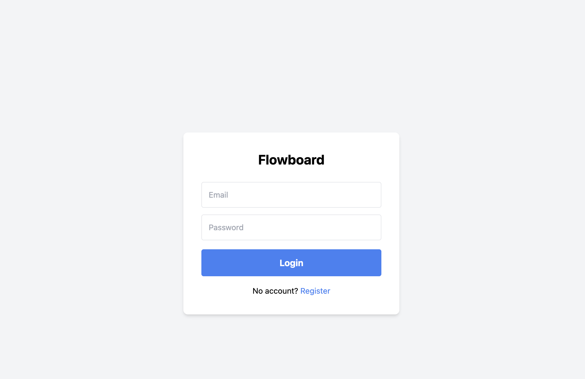
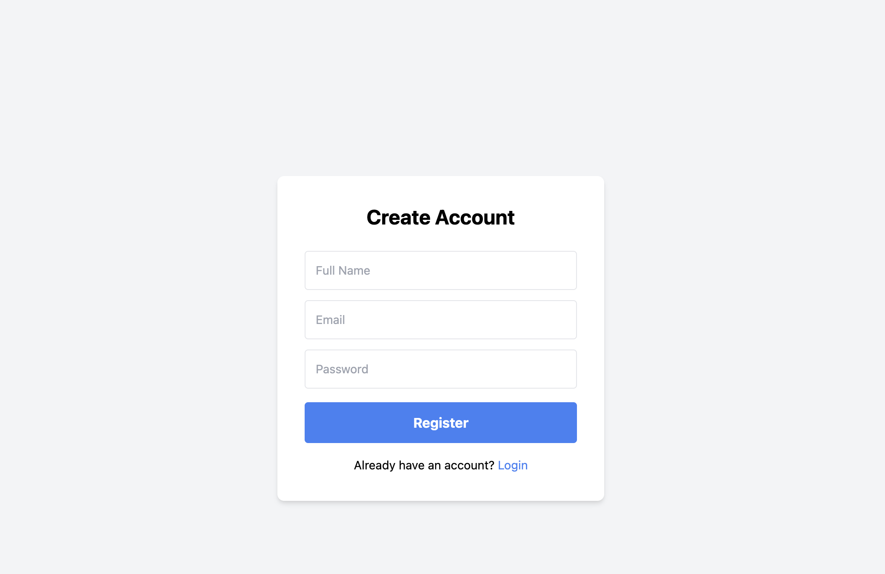
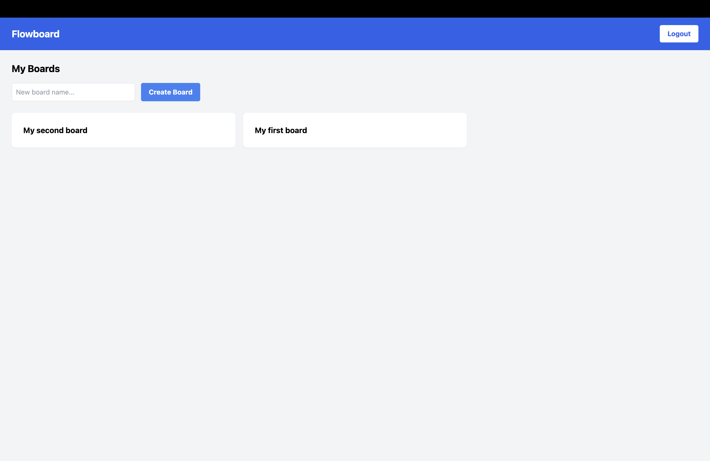
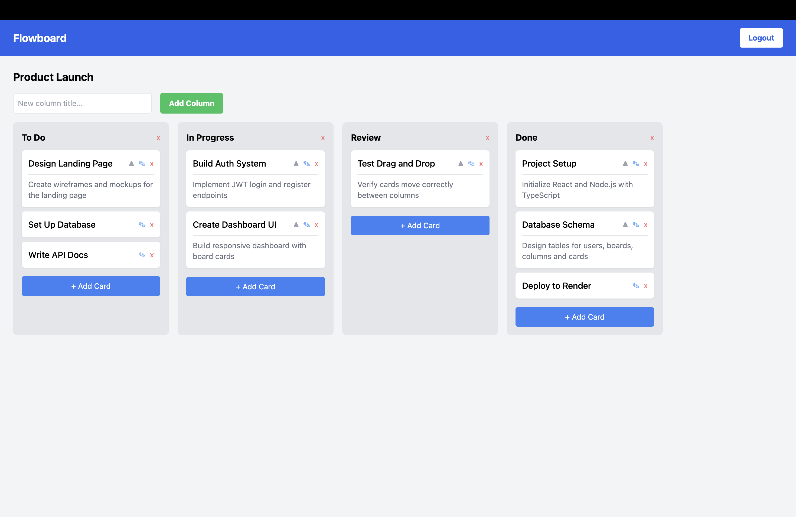

# Flowboard 

A real-time Kanban board application inspired by Trello, built with React, Node.js, and PostgreSQL.

##  Live Demo
[Flowboard](https://flowboard-frontend-n3zc.onrender.com)

##  Screenshots





## Tech Stack

### Frontend
- React + TypeScript
- Tailwind CSS
- React Router
- Socket.io Client
- DnD Kit (drag and drop)
- Axios

### Backend
- Node.js + Express + TypeScript
- PostgreSQL (Neon)
- Socket.io
- JWT Authentication
- Swagger API Docs

##  Features
-  User Authentication (Register/Login)
-  Create, Delete Boards
-  Create, Edit, Delete Columns
-  Create, Edit, Delete Cards
-  Add Description to Cards
-  Drag and Drop Cards between Columns
-  Real-time updates with Socket.io

##  API Documentation
[Swagger Docs](https://flowboard-backend-6aty.onrender.com/api/docs)

##  Run Locally

### Backend
```bash
cd backend
npm install
npm run dev
```
### Frontend
```bash
cd frontend
npm install
npm run dev
```
#### Environment Variables
Create .env in backend folder:
```
DATABASE_URL=
JWT_SECRET=
```

